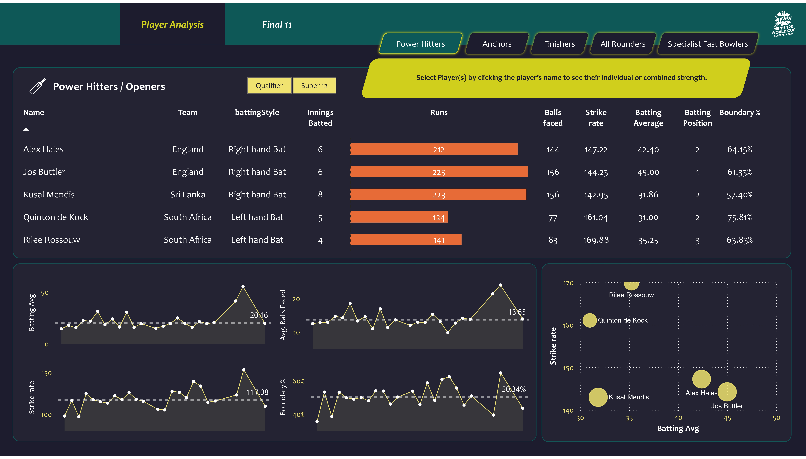
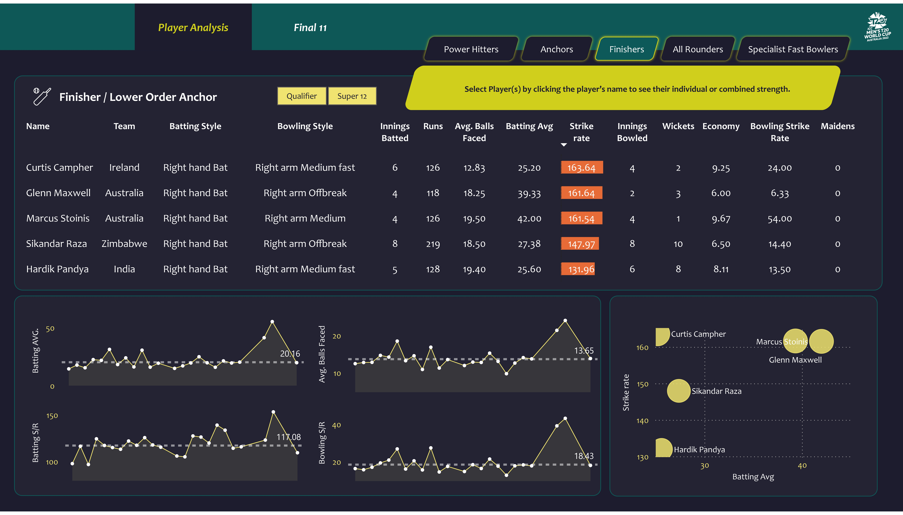
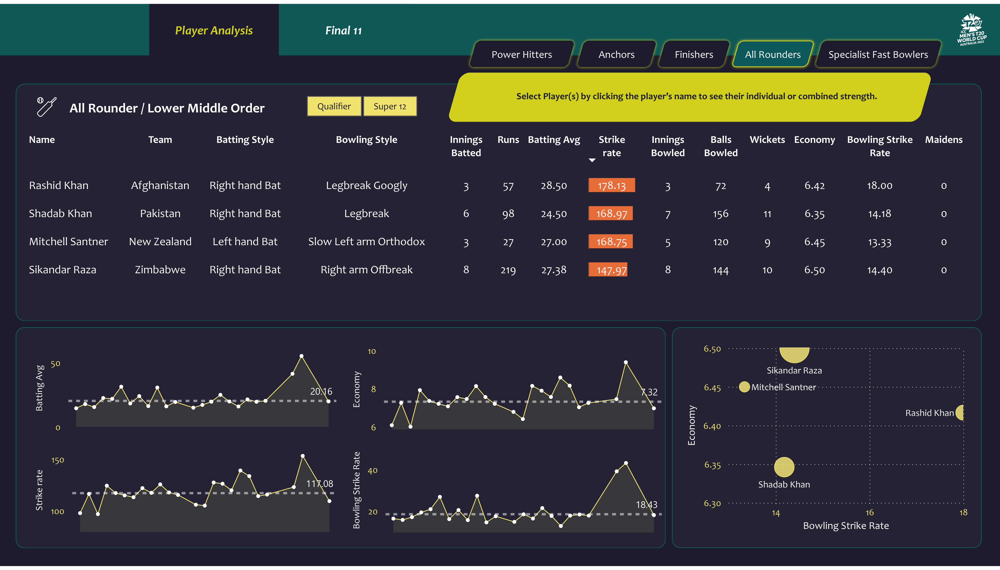
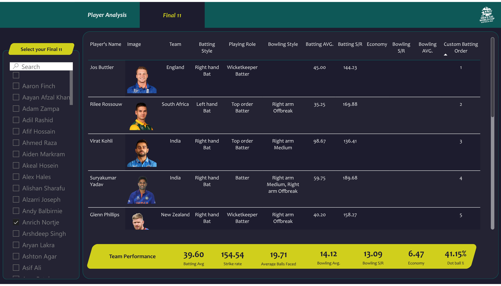

<!DOCTYPE html>
<html lang="en">
<body>
   <h1>T20 Cricket Data Analytics PowerBI Project</h1>
   <h2>Overview</h2>

   
This project is an end-to-end sports data analytics initiative. It involves web scraping data from the ESPN Cricinfo website, using Python and Pandas for data preprocessing and analysis, and creating a responsive Power BI dashboard to visualize T20     World Cup cricket data.

    
   
   
   
   
   
   

   

   <h2>Features</h2>

   <ul>
        <li><strong>Web Scraping:</strong> Collected data from the ESPN Cricinfo website using Python.</li>
        <li><strong>Data Analysis:</strong> Utilized Pandas for cleaning and analyzing the T20 World Cup cricket data.</li>
        <li><strong>Interactive Dashboard:</strong> Created a Power BI dashboard to provide visual insights into the data.</li>
        <li><strong>Responsive Design:</strong> The dashboard is designed to be accessible and user-friendly across different devices.</li>
   </ul>

   <h2>How to Use</h2>

   <ol>
        <li><strong>Accessing the Dashboard:</strong> You can access the live dashboard <a href="https://app.powerbi.com/groups/me/reports/5c377745-4037-434a-9703-6fcfd61f8813/ReportSection3a8cb23b814911c94608?bookmarkGuid=61709efa-9d22-422a-97d8-8ac33fde0ba0&bookmarkUsage=1&ctid=509b255b-13b3-4af4-bd94-9536cca3c61f&portalSessionId=cb962129-c624-4b9c-bf88-01fa2ce3fb8c&fromEntryPoint=export)">here</a>.</li>
        <li><strong>Navigating the Dashboard:</strong>
            <ul>
                <li>Upon accessing the dashboard, you'll see an overview of key metrics and insights related to the T20 World Cup cricket data.</li>
                <li>Use the interactive filters to drill down into specific teams, players, or matches.</li>
                <li>Explore different visualizations to gain a comprehensive understanding of the data.</li>
            </ul>
        </li>
   </ol>

   <h2>Technologies Used</h2>

   <ul>
        <li><strong>Python:</strong> For web scraping and data analysis.</li>
        <li><strong>Pandas:</strong> For data cleaning and preprocessing.</li>
        <li><strong>Power BI:</strong> For creating the interactive dashboard.</li>
   </ul>

</body>
</html>
